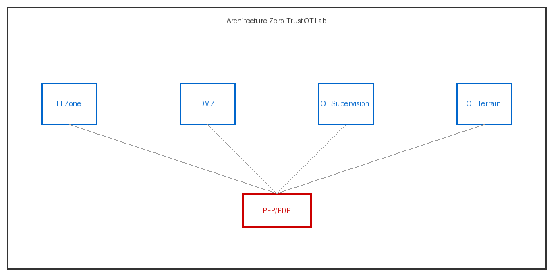
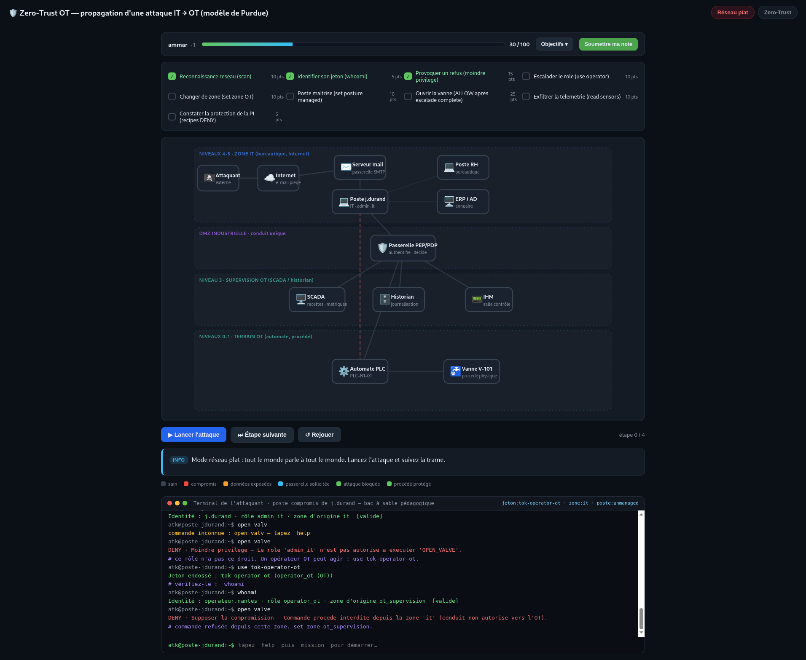

# 🔐 Zero-Trust OT Lab — AtlantIndustries

<div align="center">

[](https://opensource.org/licenses/MIT)
[](https://www.python.org/downloads/)
[](https://www.docker.com/)
[]()
[](#contributions)

**Plateforme pédagogique interactif pour maîtriser la segmentation réseau et le Zero-Trust dans l'OT industriel**

[🚀 Démarrer](#démarrage-rapide) • [📚 Documentation](#documentation) • [🎯 Architecture](#architecture) • [💻 Codespaces](#codespaces)

</div>

---

## 📋 Table des matières

- [Vue d'ensemble](#vue-densemble)
- [Caractéristiques principales](#caractéristiques-principales)
- [Architecture](#architecture)
- [Démarrage rapide](#démarrage-rapide)
- [Modes de déploiement](#modes-de-déploiement)
- [Interface graphique](#interface-graphique)
- [Structure du projet](#structure-du-projet)
- [Documentation](#documentation)

---

## 🎯 Vue d'ensemble

Ce projet transforme un **TP papier** en environnement **réel et déployable** pour le cours *Chapitre 4 — Zero-Trust & Cybersécurité Industrielle OT* (M2 BLOC 2).

Les étudiants ne simulent pas — ils manipulent de **vrais réseaux Docker isolés** et une **vraie passerelle Zero-Trust** (PEP/PDP selon NIST SP 800-207).

### 🎓 Le contraste pédagogique

| Mode | Configuration | Résultat de l'attaque |
|------|---------------|----------------------|
| **Château-fort** (réseau plat) | `docker-compose.legacy.yml` | ❌ Vanne ouverte directement |
| **Zero-Trust** (segmenté) | `docker-compose.yml` | ✅ Bloquée deux fois : réseau + politique |

---

## ✨ Caractéristiques principales

✅ **4 réseaux Docker isolés** (zones Purdue)  
✅ **PEP/PDP fonctionnel** (authentification + politiques + audit)  
✅ **Terminal interactif pédagogique** pour jouer l'attaque  
✅ **Tableau de bord live** avec logs d'audit en JSON  
✅ **Rapport de progression** CSV/JSON pour le formateur  
✅ **GitHub Codespaces ready** (auto-start, zéro config)  
✅ **Tests unitaires** sur le moteur de politique  

---

## 🏗️ Architecture

```
┌─────────────────────────────────────────────────────────────────┐
│                     it_zone (Bureau IT)                          │
│  ┌────────────────┐                                              │
│  │  attacker 🔓   │─────┐                                        │
│  │ (poste compromis)    │                                        │
│  └────────────────┘     │                                        │
└─────────────────────────┼──────────────────────────────────────┘
                          │
                          ▼
        ┌──────────────────────────────────────┐
        │  🔐 gateway (PEP/PDP)                │
        │ • Authentifie                        │
        │ • Évalue politique                   │
        │ • Journalise (audit)                │
        └──────┬──────────────────┬───────────┘
               │                  │
      ┌────────▼────┐     ┌───────▼──────┐
      │ SCADA (Lvl3)│     │ PLC (Lvl 0-1)│
      │  ot_super   │     │  ot_terrain  │
      └─────────────┘     └──────────────┘
```

**Chaque réseau Docker = une ZONE (au sens IEC 62443)**
- `it_zone` : Postes bureautiques, IT
- `dmz` : DMZ industrielle
- `ot_supervision` : Serveurs SCADA (niveau 3)
- `ot_terrain` : Automates PLC (niveaux 0-1)

La **passerelle est le SEUL conduit** entre les zones. Pas de communication directe.

---

## 🚀 Démarrage rapide

### Prérequis

- 🐳 Docker + Docker Compose v2
- 💻 Bash / Terminal
- ☁️ (Optionnel) GitHub Codespaces
- 🐍 (Optionnel) Python 3.11+ pour les tests locaux

### Installation locale

```bash
git clone https://github.com/raezon/zero-trust-ot-lab.git
cd zero-trust-ot-lab
```

### Mode 1: Réseau plat (vulnérable)

```bash
# Démarrer
make legacy-up

# Attaquer (dans un autre terminal)
make legacy-attack

# Arrêter
make legacy-down
```

**Résultat:** L'attaquant ouvre la vanne **directement** ❌

### Mode 2: Zero-Trust (sécurisé)

```bash
# Démarrer (auto-start services)
make up

# Attaquer (dans un autre terminal)
make attack

# Voir les logs en temps réel
make logs

# Arrêter
make down
```

**Résultat:** L'attaque est **bloquée** ✅

---

## ☁️ Codespaces

**Meilleure option pour les étudiants — zéro installation.**

### Créer un Codespace

1. Va sur: https://github.com/raezon/zero-trust-ot-lab
2. `Code` → `Codespaces` → `Create codespace on main`
3. **Attends ~2 minutes** (services démarrent auto en background)

### Commandes dans Codespaces

```bash
# Vérifier l'état des services
docker compose ps

# Voir les logs
docker compose logs -f gateway

# Lancer l'attaque
make attack

# Accéder au dashboard
# http://localhost:8088/dashboard
```

---

## 💡 Modes de déploiement

| Plateforme | Effort | Temps | Idéal pour |
|---|---|---|---|
| **GitHub Codespaces** | ⭐ Zéro | 2 min | Étudiants, démo |
| **Local (Docker)** | ⭐ Très bas | 5 min | Dev, testing |
| **Oracle Always Free** | ⭐⭐ Bas | 10 min | Démo publique |
| **Play with Docker** | ⭐ Zéro | 2 min | Test 4h max |

---

## 🎬 Interface graphique

### 1. Architecture Animée

**URL:** `http://localhost:8088/`

Schéma du réseau selon les niveaux de Purdue. Lancez l'attaque et regardez :
- La trame pirate se propager
- La segmentation la bloquer
- Le PDP évaluer la politique



**Features:**
- 🎮 Bascule Réseau plat ↔ Zero-Trust
- ⚡ Terminal interactif (jouer l'attaque vous-même)
- 📊 Missions pédagogiques guidées

### 2. Tableau de bord Live

**URL:** `http://localhost:8088/dashboard`

Mise à jour toutes les 2 secondes :
- État des équipements
- Données exposées
- Décisions PEP/PDP (ALLOW/DENY)
- Journal d'audit JSON



### 3. Rapport étudiant

**Accès:** Interne au terminal interactif

- Progression en temps réel
- Note sur 100
- 9 objectifs à valider

---

## 📁 Structure du projet

```
zero-trust-ot-lab/
├── README.md
├── Makefile                      # Raccourcis (up, attack, test, logs)
├── docker-compose.yml            # Mode ZERO-TRUST
├── docker-compose.legacy.yml     # Mode RÉSEAU PLAT
├── .devcontainer/                # Config GitHub Codespaces
│   ├── devcontainer.json
│   ├── postCreateCommand.sh      # Auto-start services
│   └── README.md
├── docs/
│   ├── 00-architecture.md        # Topologie réseau détaillée
│   ├── 01-enonce-tp.md           # Énoncé étudiant
│   ├── 02-corrige.md             # Corrigé formateur
│   └── 03-guide-terminal-debutant.md
├── services/
│   ├── gateway/                  # PEP + PDP
│   │   ├── app.py                # API FastAPI
│   │   ├── policies.py           # Moteur de décision
│   │   ├── identities.py         # IAM
│   │   ├── dashboard.html        # UI interactive
│   │   └── Dockerfile
│   ├── scada/                    # Serveur SCADA
│   │   └── app.py
│   └── plc/                      # Automate industriel
│       └── app.py
├── attacker/                     # Scénario mouvement latéral
│   ├── attack.py
│   └── Dockerfile
└── tests/                        # Tests unitaires pytest
    └── test_policies.py
```

---

## 📚 Documentation

### Pour les formateurs

- [**Architecture détaillée**](docs/00-architecture.md) — Zones, conduits, flux PEP/PDP
- [**Corrigé**](docs/02-corrige.md) — Attentes et solutions

### Pour les étudiants

- [**Énoncé du TP**](docs/01-enonce-tp.md) — Tâches et missions
- [**Guide débutant**](docs/03-guide-terminal-debutant.md) — Pentest pas-à-pas

### API Reference

**Commandes curl** sur la passerelle (mode Zero-Trust actif) :

```bash
# Opérateur OT légitime -> ALLOW
curl -X POST http://localhost:8088/command \
  -H "Authorization: Bearer tok-operator-ot" \
  -H "X-Source-Zone: ot_supervision" \
  -H "X-Device-Posture: managed" \
  -H "Content-Type: application/json" \
  -d '{"target":"plc","action":"OPEN_VALVE"}' | jq

# Administrateur IT, zone interdite -> DENY
curl -X POST http://localhost:8088/command \
  -H "Authorization: Bearer tok-admin-it" \
  -H "X-Source-Zone: it_zone" \
  -H "X-Device-Posture: unmanaged" \
  -H "Content-Type: application/json" \
  -d '{"target":"plc","action":"OPEN_VALVE"}' | jq
```

---

## 🔑 Variables d'environnement

Crée un `.env` depuis `.env.example` :

```bash
cp .env.example .env
```

Configurables :
- `LAB_MODE` : `zero-trust` | `legacy`
- `INSTRUCTOR_CODE` : Code d'accès formateur (défaut: `prof`)
- `REPORT_TO` : E-mail pour rapports (optionnel, SMTP requis)

---

## 🧪 Tests

### Unitaires (sans Docker)

```bash
pip install -r tests/requirements.txt
pytest tests/ -v
```

Tests le moteur de politique indépendamment.

### Intégration (avec Docker)

```bash
make up
# Tests automatiques inclus dans docker-compose.yml
make logs
```

---

## 📊 Correspondance cours ↔ Projet

| Concept | Implémentation |
|---------|---|
| Modèle Purdue (niveaux 0-5) | Réseaux Docker: `it_zone`, `dmz`, `ot_supervision`, `ot_terrain` |
| Zones et conduits | Topologie réseau; passerelle = seul conduit |
| PEP/PDP (NIST 800-207) | `services/gateway/` |
| Vérifier explicitement | Authentification jeton + posture appareil |
| Moindre privilège | Matrice RBAC dans `policies.py` |
| Supposer compromission | Refus commandes depuis zone IT |
| Vérifier continuellement | TTL jeton + audit JSON continu |
| Scénario réaliste | Mouvement latéral IT → OT via `attacker/` |

---

## 🤝 Contributions

Les contributions sont bienvenues! Ouvrez une issue ou un PR.

---

## ⚠️ Avertissement

**Cadre pédagogique uniquement.** Les jetons sont en clair et les attaques sont simulées. À n'utiliser que dans un environnement de laboratoire isolé.

---

## 📞 Support

- 📧 Email: amardjebabla10@gmail.com
- 🐛 Issues: [GitHub Issues](https://github.com/raezon/zero-trust-ot-lab/issues)
- 📖 Docs: Voir le dossier `docs/`

---

<div align="center">

**Made with ❤️ for Industrial Security Education**

[⬆ Back to top](#-zero-trust-ot-lab--atlantindustries)

</div>
