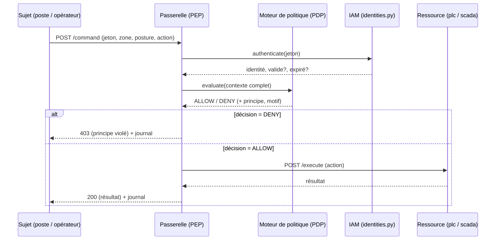

# Architecture du lab

## 1. Zones et conduits (IEC 62443) → réseaux Docker

Chaque **zone** au sens IEC 62443 est matérialisée par un **réseau Docker
isolé**. Deux services ne peuvent communiquer que s'ils partagent un réseau :
c'est la microsegmentation, appliquée pour de vrai.

| Zone (réseau Docker) | Niveau Purdue | Contenu | Services rattachés |
|----------------------|---------------|---------|--------------------|
| `it_zone` | 4-5 (IT) | postes bureautiques, ERP, Azure AD | `attacker` |
| `dmz` | DMZ industrielle | serveurs relais, historian répliqué | `gateway` |
| `ot_supervision` | 3 | SCADA Wonderware, historian | `scada`, `gateway` |
| `ot_terrain` | 0-1 | automates (PLC), capteurs/vanne | `plc`, `gateway` |

La **passerelle** est le seul service présent dans plusieurs zones : c'est
l'unique **conduit** entre l'IT et l'OT. Tout le reste est cloisonné.

> Correspondance AtlantIndustries (TD1/TD4) : `it_zone` = Zone IT (Nantes +
> Wrocław), `ot_supervision` = SCADA Wonderware existant (niveau 3),
> `ot_terrain` = ≈250 capteurs/automates par site (niveaux 0-1), la `dmz` est
> la DMZ industrielle « à créer ».

## 2. Le point clé de la démonstration

Dans `docker-compose.yml`, le conteneur `attacker` est **uniquement** sur
`it_zone`. Il ne partage aucun réseau avec `plc` (sur `ot_terrain`).

- Une tentative directe `http://plc:8000` échoue dès la **résolution DNS** :
  du point de vue de l'attaquant, l'automate *n'existe pas*. → défense n°1 :
  **segmentation réseau**.
- L'attaquant est donc contraint de passer par la passerelle. Là, même avec un
  identifiant IT valide (volé par hameçonnage), la **politique** le refuse. →
  défense n°2 : **Zero-Trust applicatif**.

Deux barrières indépendantes : c'est la défense en profondeur.

## 3. Flux d'une demande d'accès (PEP/PDP)



Le sujet ne parle **jamais** directement à la ressource : conforme à NIST
SP 800-207.

## 4. Les cinq principes, traduits en règles de code

Fichier : `services/gateway/policies.py`, fonction `evaluate()`. Politique par
défaut : **DENY**. Les règles sont évaluées dans l'ordre ; la première qui
refuse arrête l'évaluation.

| # | Principe | Règle implémentée | Motif de refus type |
|---|----------|-------------------|---------------------|
| 1 | Vérifier explicitement | jeton valide obligatoire | jeton absent/invalide |
| 2 | Vérifier en continu | jeton non expiré (TTL) | jeton expiré |
| 3 | Moindre privilège | matrice `RBAC` rôle→actions | action non permise au rôle |
| 4 | Supposer la compromission | commande procédé interdite hors zones OT | commande émise depuis `it` |
| 5 | Vérifier explicitement (posture) | appareil `managed` pour action sensible | poste `unmanaged` |

### Matrice RBAC

| Rôle | Lectures | Commandes procédé |
|------|----------|-------------------|
| `admin_it` | ✅ | ❌ |
| `operator_ot` | ✅ | ✅ (depuis une zone OT, poste maîtrisé) |
| `maintenance` | `READ_STATE` seulement | ❌ |

C'est ce tableau qui fait qu'un **identifiant IT volé ne suffit pas** : le rôle
`admin_it` n'a tout simplement pas le droit d'ouvrir la vanne.

## 5. Journalisation (alimente la « vérification continue »)

Chaque décision est écrite en JSON sur la sortie de la passerelle
(`make logs`). Exemple de refus :

```json
{"ts":"2026-09-24T10:12:03","effect":"DENY","principle":"Moindre privilege",
 "reason":"Le role 'admin_it' n'est pas autorise a executer 'OPEN_VALVE'.",
 "user":"j.durand","role":"admin_it","action":"OPEN_VALVE","target":"plc",
 "source_zone":"it","device_posture":"unmanaged"}
```

Ces événements sont le matériau brut d'une détection (SIEM/IDS) : dans un
prolongement du TP, on peut les faire remonter vers une supervision commune
IT/OT.

## 6. Positionnement des sondes (rappel Section 4)

Cohérent avec le cours : on privilégie l'**IDS passif** (écoute) aux niveaux
bas. Ici, le point de blocage actif (l'équivalent d'un IPS) est **la
passerelle en DMZ**, jamais en coupure sur le niveau 0/1. L'automate n'est
jamais interrompu par la sécurité : il est simplement **inatteignable** sans
décision favorable du PEP.
